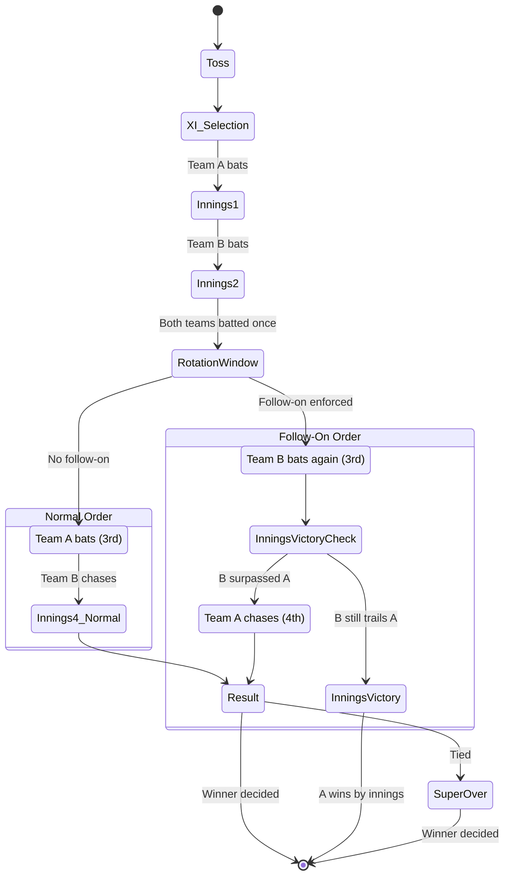
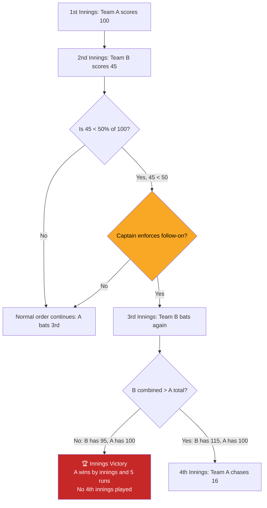
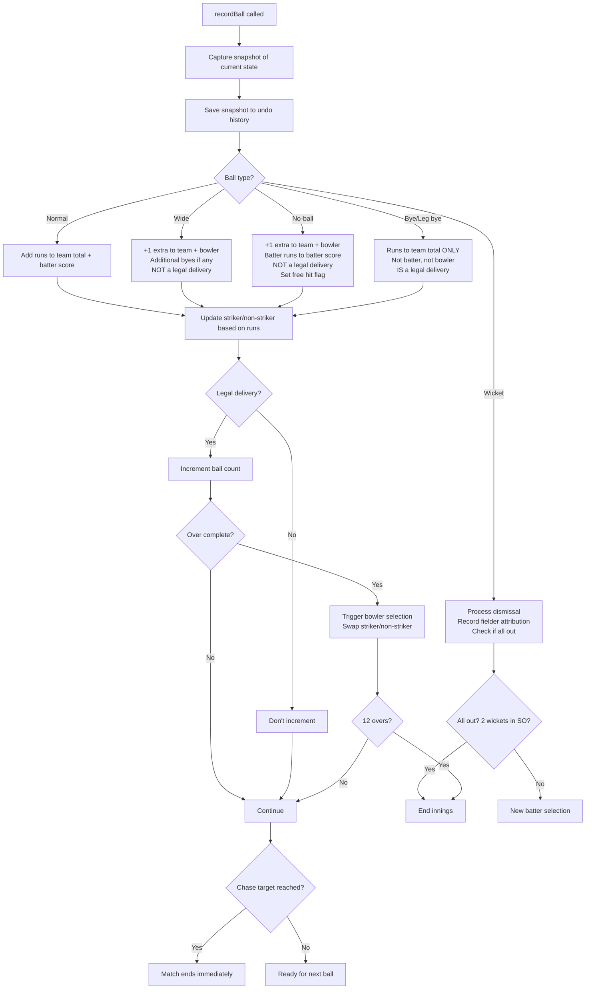
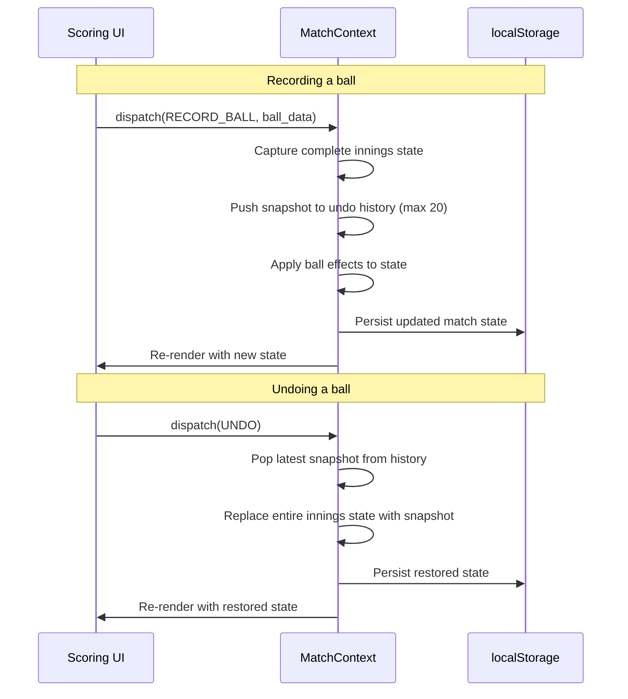
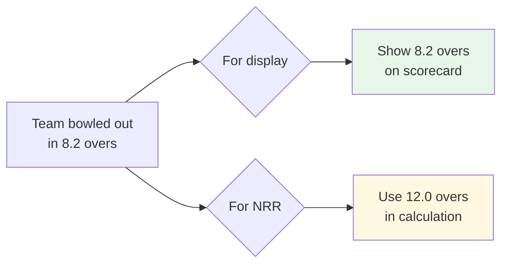
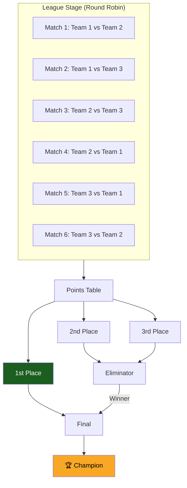

<p align="center">
  
</p>

<h1 align="center">🏏 NCC Edition 5 — Tournament Management App</h1>

<p align="center">
  <strong>A real-time cricket scoring and tournament management platform built for the Norman Cricket Championship's T20-Test hybrid format.</strong>
</p>

<p align="center">
  <a href="#-architecture">Architecture</a> •
  <a href="#-the-format">The Format</a> •
  <a href="#-scoring-engine">Scoring Engine</a> •
  <a href="#-snapshot-undo-system">Undo System</a> •
  <a href="#-data-layer">Data Layer</a> •
  <a href="#-getting-started">Getting Started</a>
</p>

---

## 🎯 What Is This?

NCC Edition 5 is not a standard cricket tournament — and this is not a standard cricket app.

The tournament uses a **T20-Test hybrid format**: 4 innings per match, 12 overs each, with cumulative scoring, squad rotation between innings, and a **follow-on rule** that can flip the entire match on its head. This app was built from scratch to handle all of it — because nothing else could.

### Key Challenges Solved

| Challenge | Solution |
|-----------|----------|
| Cumulative scoring across 4 innings | State machine with running totals and lead/deficit tracking |
| Follow-on flips batting order mid-match | Dynamic innings sequencing with A-B-B-A support |
| Innings victory (match ends after 3 innings) | Post-3rd-innings victory detection when follow-on is active |
| Squad rotation (1–5 subs between innings) | Rotation window with validation, substituted players can't return |
| Reliable undo on a phone during live play | Snapshot-based state restoration (not surgical reversal) |
| Time penalties that compress the field | Progressive fielding restriction reduction by umpire discretion |
| Accurate NRR in a multi-innings format | ICC-style calculation treating each match as 24 overs per side |
| Real-time sync across devices | Firebase Realtime Database with debounced writes and offline fallback |

---

## 🏗 Architecture

```
┌─────────────────────────────────────────────────────────┐
│                  React 19 + Vite SPA                     │
│                                                          │
│  ┌──────────┐  ┌──────────┐  ┌──────────┐  ┌─────────┐ │
│  │Dashboard │  │  Match   │  │  Teams   │  │  Stats  │ │
│  │  Page    │  │  Page    │  │  Page    │  │  Page   │ │
│  └────┬─────┘  └────┬─────┘  └────┬─────┘  └────┬────┘ │
│       │              │             │              │      │
│  ┌────┴──────────────┴─────────────┴──────────────┴────┐ │
│  │              Component Layer                         │ │
│  │  Scoring · ScoreDisplay · MatchSetup · OverSummary   │ │
│  │  SquadRotation · BattingOrder · SuperOver            │ │
│  │  BallHistoryTimeline · MatchScorecard · InningsBreak │ │
│  └──────────────────────┬──────────────────────────────┘ │
│                         │                                │
│  ┌──────────────────────┴──────────────────────────────┐ │
│  │              Context Layer (State Machines)           │ │
│  │  MatchContext · TournamentContext · AuthContext        │ │
│  └──────────────────────┬──────────────────────────────┘ │
│                         │                                │
│  ┌──────────────────────┴──────────────────────────────┐ │
│  │              Business Logic (/lib)                    │ │
│  │  overs.js · standings.js · stats.js · spirit.js      │ │
│  │  playerStats.js · dismissalText.js · ballDisplay.js  │ │
│  │  matchReport.js · squadUtils.js · constants.js       │ │
│  └──────────────────────┬──────────────────────────────┘ │
│                         │                                │
│  ┌──────────────────────┴──────────────────────────────┐ │
│  │              Data Layer                               │ │
│  │  Firebase Realtime DB (sync) + localStorage (offline) │ │
│  │  useFirebaseSync.js · storage.js · firebase.js        │ │
│  └─────────────────────────────────────────────────────┘ │
└─────────────────────────────────────────────────────────┘
```

### Tech Stack

| Layer | Technology | Why |
|-------|-----------|-----|
| Framework | React 19 + Vite 7 | Fast HMR, code-splitting via lazy routes |
| Routing | React Router 7 | SPA navigation with protected routes |
| Styling | CSS with custom properties | Dark theme, mobile-first (480px optimized) |
| Database | Firebase Realtime DB | Real-time sync across scorer/spectator devices |
| Offline | localStorage + Service Worker | Full offline scoring — no internet needed on match day |
| Auth | Firebase Auth | Email/password + email-link sign-in, role-based access |
| Testing | Vitest | 305+ tests across the scoring engine and utilities |
| Deployment | Vercel | SPA rewrites, zero-config hosting |

---

## 🏏 The Format

NCC Edition 5 uses a **T20-Test hybrid** — four 12-over innings with cumulative scoring, modeled after Test cricket but played at T20 pace.

### Match Flow



### The Follow-On

The signature mechanic of Edition 5. If Team B's 2nd innings total is **strictly less than 50%** of Team A's 1st innings total, Team A may enforce the follow-on during the Rotation Window.

```
Normal:     A → B → A → B
Follow-on:  A → B → B → A    ← batting order flips
```

This creates a strategic dilemma: enforcing the follow-on means Team A bats **last** (4th innings chase), surrendering the advantage of knowing the target while batting.



### Rotation Window

After the 2nd innings, a **Rotation Window** opens where both teams:

1. **Substitute 1–5 players** from their 15-player squad (substituted players cannot return)
2. **Declare follow-on** (if eligible)

Both decisions are submitted simultaneously and become final when the window closes.

---

## ⚙️ Scoring Engine

The scoring engine (driven by `MatchContext.jsx`) handles ball-by-ball recording with proper cricket rules for a multi-innings cumulative format. It operates as a state machine progressing through: `setup → toss → select-xi → batting-order → scoring → innings-break → match-over → super-over`.

### Ball Recording Flow



### Extras Attribution Matrix

Getting extras wrong corrupts every batting average and bowling economy in the tournament.

| Delivery | Team Total | Batter Score | Bowler Conceded | Legal Ball? | Strike Change |
|----------|-----------|-------------|----------------|-------------|--------------|
| Normal runs (1,2,3,4,6) | +runs | +runs | +runs | ✅ | Odd runs = swap |
| Dot ball | — | — | — | ✅ | No |
| Wide | +1 (+byes) | — | +1 (+byes) | ❌ | Only if odd byes |
| No-ball | +1 (+batter runs) | +batter runs | +1 (+batter runs) | ❌ | Based on batter runs |
| Bye | +runs | — | — | ✅ | Odd runs = swap |
| Leg bye | +runs | — | — | ✅ | Odd runs = swap |

### Overs Display

Cricket uses a special notation where `1.3` means 1 over and 3 balls — **not** 1.3 as a decimal.

```javascript
// /lib/overs.js

// For display: cricket notation
ballsToOvers(3)   → "0.3"    // 3 balls bowled
ballsToOvers(9)   → "1.3"    // 1 over and 3 balls
ballsToOvers(50)  → "8.2"    // 8 overs and 2 balls
ballsToOvers(72)  → "12.0"   // full innings

// For NRR math: true decimal
ballsToDecimalOvers(3)  → 0.5     // half an over
ballsToDecimalOvers(9)  → 1.5
ballsToDecimalOvers(50) → 8.333
```

Storage rule: **always store balls as integer count of legal deliveries.** Never store overs as a float.

---

## ↩️ Snapshot Undo System

Early implementations tried to reverse individual ball effects (subtract runs, restore batters, fix strike rotation). This was fragile and broke constantly. We replaced it with a **state snapshot architecture**.

### How It Works



### Why Snapshots?

| Approach | Pros | Cons |
|----------|------|------|
| **Surgical reversal** | Low storage | Breaks on complex interactions (no-ball + run out + odd runs + free hit). Every new feature adds reversal logic. |
| **Snapshot restore** ✅ | Always correct. No reversal logic. Jump back multiple balls. | ~2–5 KB per ball. 20 snapshots ≈ 100 KB per innings. |

Each snapshot stores the **complete innings state**: team total, all batter scores, all bowler figures, striker/non-striker, free hit flag, fall of wickets, fielding events, and partnership data. Restoring a snapshot is a single atomic write — no calculations, no missed edge cases.

**Limit: 20 snapshots per innings** (oldest deleted when 21st is created). The user presses a single Undo button repeatedly — each press goes back one ball. Simple mental model, reliable architecture.

---

## 🗄 Data Layer

The app uses a **dual persistence strategy**: Firebase Realtime Database for cross-device sync, and localStorage for offline resilience.

### Firebase Realtime Database

Real-time sync is handled by `useFirebaseSync.js`, a custom hook that:

- **Writes** tournament and match state to Firebase with 500ms debouncing
- **Reads** live updates via `onValue` listeners for spectator mode
- **Falls back** to localStorage when Firebase is unavailable (no internet on match day)
- **Handles** Firebase's array-to-object serialization quirks with `deepRestoreArrays()`

### localStorage Schema

| Key | Data | Purpose |
|-----|------|---------|
| `ncc_tournament` | Tournament state (teams, matches, phase) | Offline tournament management |
| `ncc_match_${matchId}` | Full match state per match | Offline scoring, crash recovery |

### Auth & Roles

Firebase Authentication provides four access levels:

| Role | Capabilities |
|------|-------------|
| **Owner** | Full access — tournament setup, team management, scoring |
| **Organizer** | Scoring, team management, match administration |
| **Player** | View matches, teams, stats |
| **Spectator** | Read-only access (configurable via `VITE_SPECTATOR_MODE`) |

### State Management

Three React Contexts form the application's state tree:

```
BrowserRouter
  └── AuthProvider (AuthContext)
        └── TournamentProvider (TournamentContext)
              └── App
                    └── MatchProvider (MatchContext) — per scoring page
```

- **AuthContext** — Firebase auth state, role resolution, login/logout
- **TournamentContext** — Tournament phase, teams, matches, league schedule auto-generation
- **MatchContext** — Match state machine, ball-by-ball scoring, undo history, innings transitions

---

## 📊 NRR Calculation

Net Run Rate in a multi-innings cumulative format requires careful handling.

```
NRR = (Total runs scored ÷ Total overs faced) − (Total runs conceded ÷ Total overs bowled)
```

**Key rules:**

- Each match = **24 overs per team** maximum (2 innings × 12 overs)
- If a team is **all out**, the full **12 overs** are counted for NRR (not actual overs faced) — standard ICC limited-overs convention
- Follow-on does not change the calculation — only the batting order changes
- Uses `ballsToDecimalOvers()` for true decimal math (not cricket notation)



---

## ⏱ Pace of Play Enforcement

Instead of reducing overs (which distorts strategy), NCC Edition 5 uses **progressive fielding restriction penalties**.

```
Innings time limit: 50 minutes

IF innings exceeds 50 minutes:
│
├─ FIELDING side causing delay (umpire discretion):
│   ├─ +5 min: max outside circle 5 → 4
│   ├─ +10 min: 4 → 3
│   ├─ +15 min: 3 → 2
│   ├─ +20 min: 2 → 1
│   └─ +25 min: 1 → 0 (all fielders inside circle)
│   Penalty is PERMANENT — cannot be reversed.
│
└─ BATTING side causing delay (umpire discretion):
    └─ 5-run penalty per 5-minute block
```

---

## 🏆 Tournament Structure



**3 teams, 6 league matches** (each pair plays twice) — auto-generated when all teams are added.

**Points:** Win = 2, Tie/NR = 1, Loss = 0

**Tiebreakers (in order):** NRR → Head-to-head → Total runs scored

---

## 🚀 Getting Started

### Prerequisites

- Node.js 18+
- A Firebase project (Realtime Database + Authentication enabled)

### Installation

```bash
git clone https://github.com/your-username/ncc-edition-5.git
cd ncc-edition-5/CricketScoringApp
npm install
```

### Firebase Setup

1. Create a Firebase project at [console.firebase.google.com](https://console.firebase.google.com)
2. Enable **Realtime Database** and **Email/Password Authentication**
3. Copy `.env.example` to `.env` and fill in your Firebase config:

```bash
cp .env.example .env
```

```env
VITE_FIREBASE_API_KEY=your-api-key
VITE_FIREBASE_AUTH_DOMAIN=your-project.firebaseapp.com
VITE_FIREBASE_DATABASE_URL=https://your-project-default-rtdb.firebaseio.com
VITE_FIREBASE_PROJECT_ID=your-project-id
VITE_FIREBASE_STORAGE_BUCKET=your-project.appspot.com
VITE_FIREBASE_MESSAGING_SENDER_ID=123456789
VITE_FIREBASE_APP_ID=1:123456789:web:abcdef
VITE_SPECTATOR_MODE=false
```

### Development

```bash
npm run dev
```

Open [http://localhost:5173](http://localhost:5173) on your phone or browser.

### Production Build

```bash
npm run build     # Output to /dist
npm run preview   # Preview the production build locally
```

The build produces code-split bundles: `vendor-react`, `vendor-firebase`, and lazy-loaded route chunks.

### Running Tests

```bash
npm test                    # Run all 305+ tests
npm run test:watch          # Watch mode for development
```

Test files are co-located with their modules and in `src/lib/__tests__/`:

```bash
# Key test suites
src/lib/__tests__/scoring-engine.test.js   # Ball recording, extras, wickets
src/lib/__tests__/overs.test.js            # Cricket notation conversions
src/lib/__tests__/super-over.test.js       # Super over mechanics
src/lib/__tests__/undo.test.js             # Snapshot undo system
src/lib/__tests__/rotation.test.js         # Squad rotation validation
src/lib/__tests__/chase-completion.test.js # Target chase & innings end
src/lib/__tests__/extras-cascade.test.js   # Extras attribution accuracy
src/lib/__tests__/fielder-attribution.test.js  # Dismissal fielder tracking
src/lib/__tests__/strike-rotation.test.js  # Striker/non-striker swaps
src/lib/__tests__/tournament.test.js       # NRR & points table
src/lib/__tests__/stats-comprehensive.test.js  # Leaderboards
src/context/MatchContext.test.js           # Match state machine
src/context/TournamentContext.test.js      # Tournament state
src/e2e/tournament.test.js                # End-to-end tournament flow
```

---

## 📁 Project Structure

```
CricketScoringApp/
├── src/
│   ├── main.jsx                          # Entry point — providers + router
│   ├── App.jsx                           # Route definitions (lazy-loaded)
│   ├── index.css                         # Global styles (dark theme, mobile-first)
│   │
│   ├── pages/
│   │   ├── Dashboard.jsx                 # Points table, match list, schedule
│   │   ├── LoginPage.jsx                 # Firebase auth (email/password/link)
│   │   ├── AdminPage.jsx                 # Tournament setup, team management
│   │   ├── MatchPage.jsx                 # Match viewer (live + completed)
│   │   ├── MatchScoringPage.jsx          # Ball-by-ball scoring interface
│   │   ├── TeamsPage.jsx                 # Squad rosters & player info
│   │   └── StatsPage.jsx                 # Leaderboards & records
│   │
│   ├── components/
│   │   ├── Scoring.jsx                   # Ball input (runs, extras, wicket buttons)
│   │   ├── ScoreDisplay.jsx              # Live score visualization
│   │   ├── MatchSetup.jsx               # Toss & Playing XI selection
│   │   ├── BattingOrder.jsx              # Batting lineup configuration
│   │   ├── OverSummary.jsx               # Over-by-over breakdown
│   │   ├── BallHistoryTimeline.jsx       # Ball-by-ball playback
│   │   ├── MatchScorecard.jsx            # Full scorecard display
│   │   ├── SuperOver.jsx                 # Super over handling
│   │   ├── InningsBreak.jsx              # Between-innings UI
│   │   ├── MatchResult.jsx               # Match completion & winner display
│   │   ├── SquadRotation.jsx             # Substitution management
│   │   ├── PointsTable.jsx               # League standings widget
│   │   ├── MatchSchedule.jsx             # League schedule display
│   │   ├── SpiritTracker.jsx             # Rotation diversity tracker
│   │   ├── NavBar.jsx                    # Bottom navigation bar
│   │   ├── ProtectedRoute.jsx            # Role-based route guard
│   │   ├── SyncStatus.jsx                # Firebase sync indicator
│   │   └── ErrorBoundary.jsx             # Error handling wrapper
│   │
│   ├── context/
│   │   ├── AuthContext.jsx               # Firebase auth state + role resolution
│   │   ├── TournamentContext.jsx         # Tournament phase & match management
│   │   └── MatchContext.jsx              # Match state machine & scoring engine
│   │
│   ├── lib/
│   │   ├── constants.js                  # NCC Edition 5 rules & limits
│   │   ├── overs.js                      # Cricket notation utilities
│   │   ├── standings.js                  # NRR calculation & points table
│   │   ├── stats.js                      # Match data loading & restoration
│   │   ├── playerStats.js               # Individual player analytics
│   │   ├── spirit.js                     # Rotation diversity metrics
│   │   ├── squadUtils.js                # Squad migration & player management
│   │   ├── dismissalText.js             # Wicket display formatting
│   │   ├── ballDisplay.js               # Ball outcome rendering
│   │   ├── matchReport.js               # Match report generation
│   │   ├── firebase.js                  # Firebase initialization & exports
│   │   ├── storage.js                   # localStorage persistence layer
│   │   ├── useFirebaseSync.js           # Real-time sync hook (debounced)
│   │   └── __tests__/                   # Test suite (305+ tests)
│   │
│   └── e2e/
│       └── tournament.test.js            # End-to-end tournament flow
│
├── public/
│   ├── sw.js                             # Service Worker (cache-first)
│   ├── manifest.json                     # PWA manifest
│   └── icons/                            # App icons (192px, 512px)
│
├── index.html                            # HTML shell with PWA registration
├── vite.config.js                        # Vite config + code splitting
├── eslint.config.js                      # ESLint flat config
├── vercel.json                           # Vercel SPA rewrites
├── .env.example                          # Firebase environment template
├── package.json                          # Dependencies & scripts
└── NCC_Edition5_Official_Rules.docx      # Official tournament rulebook
```

---

## 🧪 Testing Philosophy

The scoring engine is the most critical piece of software in this project. A bug during a live match produces wrong scorecards and tournament standings.

### Test Coverage Priority

| Module | Target | Why |
|--------|--------|-----|
| `MatchContext.jsx` (scoring) | >95% | Every ball type, every edge case |
| `standings.js` | >90% | NRR calculation, points table sorting |
| `SquadRotation` logic | >90% | Substitution validation |
| `overs.js` | 100% | Zero tolerance for display errors |
| `stats.js` | >85% | Qualifier thresholds, cross-innings accuracy |

### Edge Cases That Broke Things

These are real bugs we found and fixed:

- **Overs showing `0` instead of `0.3`** — Integer division truncation. Fixed with cricket notation utility.
- **Innings victory not detected** — App forced a 4th innings after follow-on domination. Fixed with post-3rd-innings victory check.
- **Super Over allowing 3 wickets** — Should be 2 (3 batters, 2 can get out). Fixed wicket limit.
- **NRR using actual overs for all-outs** — Must use full 12 overs per ICC convention. Display shows actual; NRR uses full.
- **Firebase arrays restored as objects** — Firebase converts sparse arrays to objects. Fixed with `deepRestoreArrays()` utility.

---

## 🏏 Cricket Rules Quick Reference

For developers unfamiliar with cricket — here's what you need to know to understand the codebase:

| Concept | Explanation |
|---------|-------------|
| Over | Set of 6 legal deliveries by one bowler |
| Wide | Ball too far from batter. +1 run penalty, extra ball bowled |
| No-ball | Illegal delivery (foot over crease). +1 run, extra ball, next ball = free hit |
| Free hit | After a no-ball, batter can't be out (except run out) |
| Bye | Ball passes everyone, batters run. Runs to team, not batter |
| Leg bye | Ball hits batter's body, batters run. Runs to team, not batter |
| All out | 10 wickets fallen = innings over (11 players, 10 can get out) |
| NRR | Net Run Rate — the cricket equivalent of goal difference |
| Follow-on | Dominant team can make the other team bat twice in a row |
| Innings victory | Team wins without needing to bat again (follow-on only) |

---

## 📄 License

This project is built for the Norman Cricket Championship community in Norman, Oklahoma.

---

<p align="center">
  <em>"Enforce the follow-on… or risk regret?"</em>
</p>
